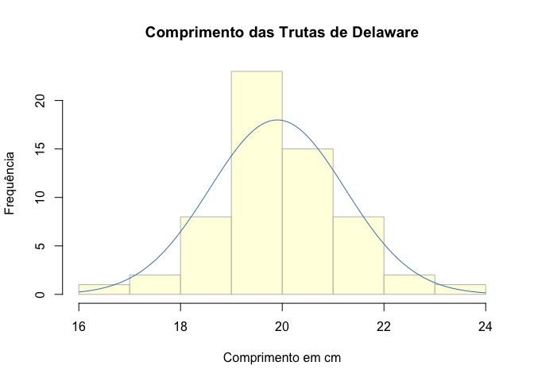
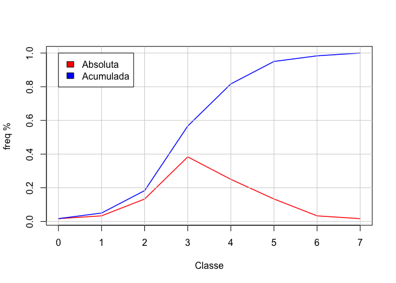
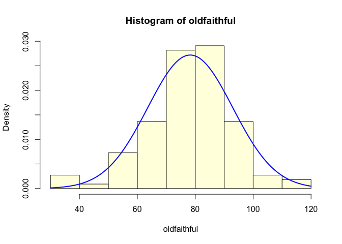
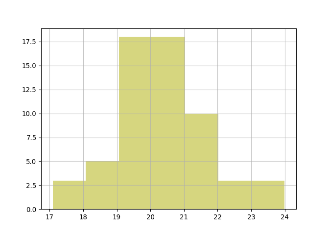
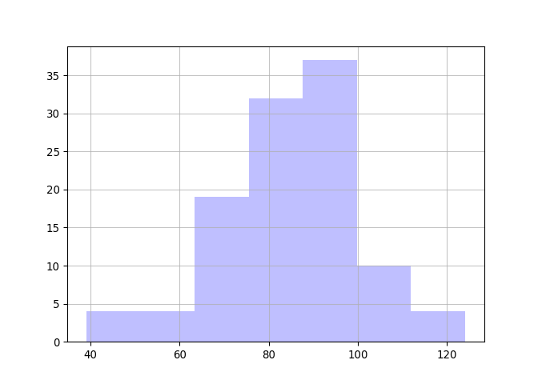

SAOB10
================
Prof. Frega
2023-03-21

- <a href="#representando-dados"
  id="toc-representando-dados">Representando dados</a>
  - <a href="#análise-em-r" id="toc-análise-em-r">Análise em
    <code>R</code></a>
  - <a href="#análise-em-python" id="toc-análise-em-python">Análise em
    Python</a>

<style>
h1, h2, h3, h4 {
  margin-bottom: 1em;
  margin-top: 2em;
}
body {
  font-size: 14pt;
}
</style>

# Representando dados

Capítulo 2 de Freund & Simon

Dados de comprimentos das trutas pescadas em Delaware e das erupções do
*Old Faithful*

## Análise em `R`

``` r
# Os dados de comprimentos das trutas estão em uma planilha armazenada no meu GitHub e podem ser lidos 
# com uma rotina da biblioteca openxlsx
dados = openxlsx::read.xlsx("https://github.com/jrfrega/SAOB10/blob/8c78783dc30515e2fb827c4abfd3e72a423192d0/trutas.xlsx?raw=true")[,1]
#
# Apresenta os dados como foram lidos
dados
```

     [1] 19.2 19.6 17.3 19.3 19.5 20.4 23.5 19.0 19.4 18.4 19.4 21.8 20.4 21.0 21.4
    [16] 19.8 19.6 21.5 20.2 20.1 20.3 19.7 19.5 22.9 20.7 20.3 20.8 19.8 19.4 19.3
    [31] 19.5 19.8 18.9 20.4 20.2 21.5 19.9 21.7 19.5 20.9 18.1 20.5 18.3 19.5 18.3
    [46] 19.0 19.2 21.9 17.0 19.7 20.7 21.1 20.6 16.6 19.4 18.6 22.7 18.5 20.1 18.6

``` r
#
# Apresenta os dados ordenados
sort(dados)
```

     [1] 16.6 17.0 17.3 18.1 18.3 18.3 18.4 18.5 18.6 18.6 18.9 19.0 19.0 19.2 19.2
    [16] 19.3 19.3 19.4 19.4 19.4 19.4 19.5 19.5 19.5 19.5 19.5 19.6 19.6 19.7 19.7
    [31] 19.8 19.8 19.8 19.9 20.1 20.1 20.2 20.2 20.3 20.3 20.4 20.4 20.4 20.5 20.6
    [46] 20.7 20.7 20.8 20.9 21.0 21.1 21.4 21.5 21.5 21.7 21.8 21.9 22.7 22.9 23.5

``` r
#
# Apresenta um histograma com uma curva normal superimposta a ele e armazena 
# algumas características na variável h
h = hist(dados, right = FALSE, breaks = seq(16, 24, 1), freq = TRUE, main = "Comprimento das Trutas de Delaware", xlab = "Comprimento em cm", ylab = "Frequência", col = "lightyellow", border = "gray"); curve(dnorm(x, mean(dados), sd(dados))*60, xlim = c(16, 24), add = TRUE, col = "steelblue")
```

<!-- -->

``` r
# 
# Aqui ficam armazenados os limites das classes
h$breaks
```

    [1] 16 17 18 19 20 21 22 23 24

``` r
#
# Este é o número de limites (que é o número de classes + 1)
(n = length(h$breaks))
```

    [1] 9

``` r
# Assim pode-se definir as classes com seus limites
(classes = data.frame(de = h$breaks[1:(n-1)], ate = h$breaks[2:n]))
```

      de ate
    1 16  17
    2 17  18
    3 18  19
    4 19  20
    5 20  21
    6 21  22
    7 22  23
    8 23  24

``` r
# 
# E pode-se agregar as frequências observadas
(classes = cbind(classes, contagem = h$counts))
```

      de ate contagem
    1 16  17        1
    2 17  18        2
    3 18  19        8
    4 19  20       23
    5 20  21       15
    6 21  22        8
    7 22  23        2
    8 23  24        1

``` r
#
# Calcula a frequência relativa de cada classe
freqrel = h$counts/sum(h$counts)
#
# Calcula e agrega a frequência relativa acumulada numa estrutura tipo data.frame
df = data.frame(freqrel, freqtot = cumsum(freqrel))
#
# Exibe os primeiros valores da estrutura
head(df, 10)
```

         freqrel    freqtot
    1 0.01666667 0.01666667
    2 0.03333333 0.05000000
    3 0.13333333 0.18333333
    4 0.38333333 0.56666667
    5 0.25000000 0.81666667
    6 0.13333333 0.95000000
    7 0.03333333 0.98333333
    8 0.01666667 1.00000000

``` r
#
# Transforma os dados em uma série temporal com início em zero para 
# rotular adequadamente o eixo x
df = ts(df, start = 0)
df
```

    Time Series:
    Start = 0 
    End = 7 
    Frequency = 1 
         freqrel    freqtot
    0 0.01666667 0.01666667
    1 0.03333333 0.05000000
    2 0.13333333 0.18333333
    3 0.38333333 0.56666667
    4 0.25000000 0.81666667
    5 0.13333333 0.95000000
    6 0.03333333 0.98333333
    7 0.01666667 1.00000000

``` r
#
# Apresenta um gráfico da frequência relativa e da frequência acumulada
color = c("red", "blue"); plot.ts(df, plot.type = "single", col = color, lwd = 1.5, xlab = "Classe", ylab = "freq %", axes = TRUE); grid(col = "lightgray", lty = 1); legend(x = 0, y = 1, legend = c("Absoluta", "Acumulada"), fill = c(color))
```

<!-- -->

``` r
#
# Forma alternativa de desenhar o gráfico
color = c("red", "blue"); plot(0:7, df[,2], type = "l", col = color[2], xlab = "Classe", lwd = 1.5, ylab = "freq %"); lines(0:7, df[,1], col = color[1], lwd = 1.5); grid(col = "lightgray", lty = 1); legend(x = 0, y = 1, legend = c("Absoluta", "Acumulada"), fill = c(color))
```

<!-- -->

``` r
#
# Gráfico de ramos e folhas
stem(dados)
```


      The decimal point is at the |

      16 | 6
      17 | 03
      18 | 13345669
      19 | 00223344445555566778889
      20 | 112233444567789
      21 | 01455789
      22 | 79
      23 | 5

``` r
#
# Dados de erupções do Old Faithful
oldfaithful = c(81, 83, 94, 73, 78, 94, 73, 89, 112, 80, 
                94, 89, 35, 80, 74, 91, 89, 83, 80, 82, 
                91, 80, 83, 91, 89, 82, 118, 105, 64, 56, 
                76, 69, 78, 42, 76, 82, 82, 60, 73, 69, 
                91, 83, 67, 85, 60, 65, 69, 85, 65, 82, 
                53, 83, 62, 107, 60, 85, 69, 92, 40, 71, 
                82, 89, 76, 55, 98, 74, 89, 98, 69, 87, 
                74, 98, 94, 82, 82, 80, 71, 73, 74, 80, 
                60, 69, 78, 74, 64, 80, 83, 82, 65, 67, 
                94, 73, 33, 87, 73, 85, 78, 73, 74, 83, 
                83, 51, 67, 73, 87, 85, 98, 91, 73, 108)
#
# Histograma com curva normal superimposta
hist(oldfaithful, freq = FALSE, col = "lightyellow")
curve(dnorm(x, mean(oldfaithful), sd(oldfaithful)), xlim = c(30, 120), add = TRUE, col = "blue", lwd = 2)
```

<!-- -->

## Análise em Python

``` python
# Bibioteca do Python para leitura de dados no Excel
import pandas as pd
#
# Biblioteca para desenhar o histograma
import matplotlib.pyplot as plt
#
# Lendo os dados
trutas = pd.read_excel("https://github.com/jrfrega/SAOB10/raw/8c78783dc30515e2fb827c4abfd3e72a423192d0/trutas.xlsx", engine="openpyxl")
#
# Transformando em dados linha
trutas = trutas.to_numpy().transpose()
#
# Pegando o primeiro elemento bidimensional
trutas[0]
#
# Desenhando o histograma
```

    array([19.2, 19.6, 17.3, 19.3, 19.5, 20.4, 23.5, 19. , 19.4, 18.4, 19.4,
           21.8, 20.4, 21. , 21.4, 19.8, 19.6, 21.5, 20.2, 20.1, 20.3, 19.7,
           19.5, 22.9, 20.7, 20.3, 20.8, 19.8, 19.4, 19.3, 19.5, 19.8, 18.9,
           20.4, 20.2, 21.5, 19.9, 21.7, 19.5, 20.9, 18.1, 20.5, 18.3, 19.5,
           18.3, 19. , 19.2, 21.9, 17. , 19.7, 20.7, 21.1, 20.6, 16.6, 19.4,
           18.6, 22.7, 18.5, 20.1, 18.6])

``` python
h = plt.hist(x = trutas[0], bins=7, color = "#AFAF0080", align = "right")
plt.grid(axis='both', alpha=0.75)
plt.show()
```

<!-- -->

``` python
plt.close('all')

oldfaithful = [ 81, 83, 94, 73, 78, 94, 73, 89, 112, 80, 
                94, 89, 35, 80, 74, 91, 89, 83, 80, 82, 
                91, 80, 83, 91, 89, 82, 118, 105, 64, 56, 
                76, 69, 78, 42, 76, 82, 82, 60, 73, 69, 
                91, 83, 67, 85, 60, 65, 69, 85, 65, 82, 
                53, 83, 62, 107, 60, 85, 69, 92, 40, 71, 
                82, 89, 76, 55, 98, 74, 89, 98, 69, 87, 
                74, 98, 94, 82, 82, 80, 71, 73, 74, 80, 
                60, 69, 78, 74, 64, 80, 83, 82, 65, 67, 
                94, 73, 33, 87, 73, 85, 78, 73, 74, 83, 
                83, 51, 67, 73, 87, 85, 98, 91, 73, 108 ]

h = plt.hist(x = oldfaithful, bins=7, color = "#8080FF80", align = "right")
plt.grid(axis='both', alpha=0.75)
plt.show()
```

<!-- -->

``` python
plt.close('all')
```
